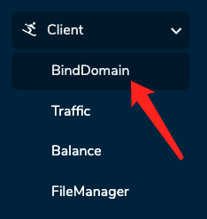
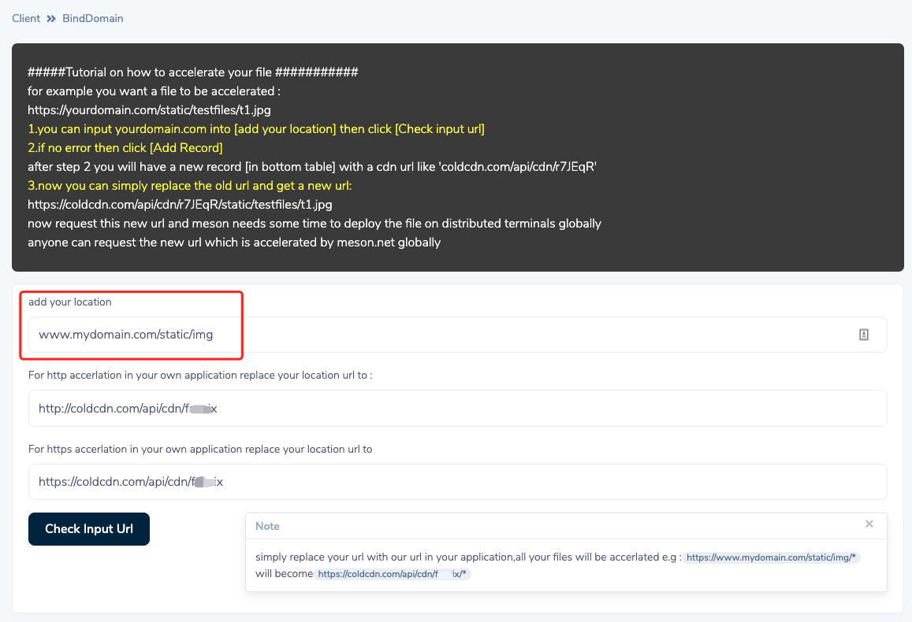
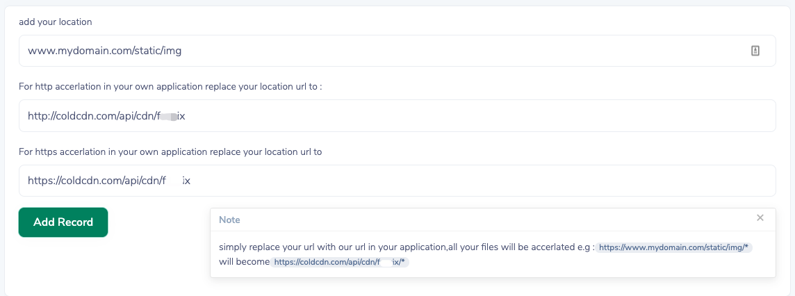

- [Step1. Register an account and log in](#step1-register-an-account-and-log-in)
- [Step2. Create resource acceleration link](#step2-create-resource-acceleration-link)
- [Step3. Replace the original static resource link in the webpage with an accelerated link](#step3-replace-the-original-static-resource-link-in-the-webpage-with-an-accelerated-link)

### Step1. Register an account and log in

Enter official website  <https://meson.network>

Register as a cdn user

Check the cdn user

### Step2. Create resource acceleration link

Enter the `Client => BindDomain` page,

Create resource acceleration link

Fill in the link of your website's static resources in the red box.

For example, if you want to accelerate all the image resources in your website, which are stored in the root directory of `website/static/img` directory, you can fill in here. e.g. www.yourdomain.com/static/img

Click `Check Input Url`

If the verification is correct, the button will turn green, click `Add Record`

The acceleration link you created will be displayed below

### Step3. Replace the original static resource link in the webpage with an accelerated link

Replace resource link

Replace the resource link you need to accelerate with the link you generated in the previous step, as shown in the figure above, replace the content in the red box with the new link.

If your webpage supports https, please use https://, if not, please use http://

