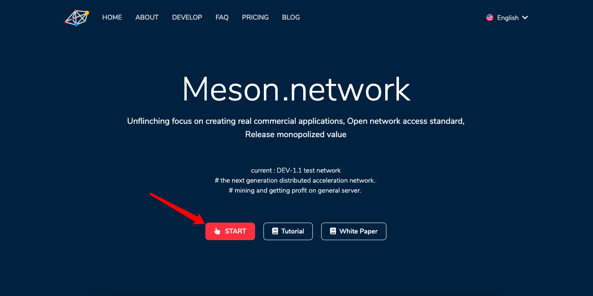
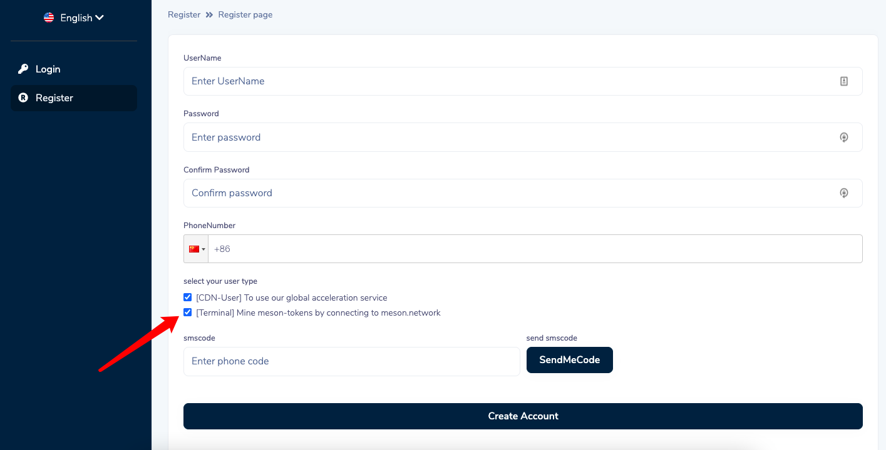
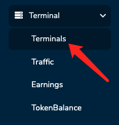
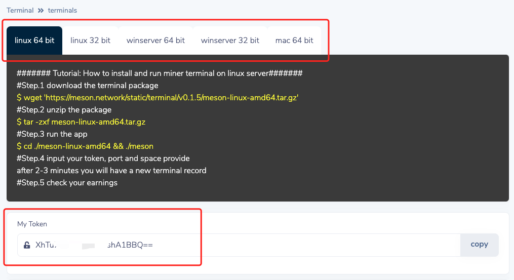
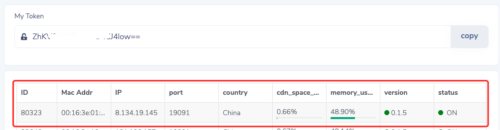

- [Step1. Register an account and log in](#step1-register-an-account-and-log-in)
- [Step2. Download and run the Terminal client](#step2-download-and-run-the-terminal-client)
- [Step3. Check the server status](#step3-check-the-server-status)
- [Step4. Keep terminal running in the background](#step4-keep-terminal-running-in-the-background)

You need a public IP to become a miner and earn your tokens.

### Step1. Register an account and log in

Enter official website  <https://meson.network>

Register as a `terminal` user

Check `terminal` user

### Step2. Download and run the Terminal client

Enter the `Terminal=>Terminals` page,

ssh to your server, select the client corresponding to your operating system, download, unzip and run

When running for the first time, the program will prompt you:

`token` -- User identifier, you can get this from the website

`spaceLimit` -- Hard disk space provided for service, at least 80G. The more  storage space you provide, the higher profit you  will get

`port` -- External service port

  1. please do not use port 80 or 443
  2. make ensure that your firewall will not block your port

### Step3. Check the server status

Usually in a few minutes, you can see that your server is online and running.

If the server's `Status` is `ON` which indicates that your server has been running successfully and has been included in our acceleration network.

### Step4. Keep terminal running in the background

we recommend you :

1. Setup a background process to run the terminal
2. Configure an auto-start program to run the  terminal

Note:
In the meson network, the same IP is regarded as the same machine, so please do not run multiple Terminal programs on the same IP and the same server. This will not increase your income.

